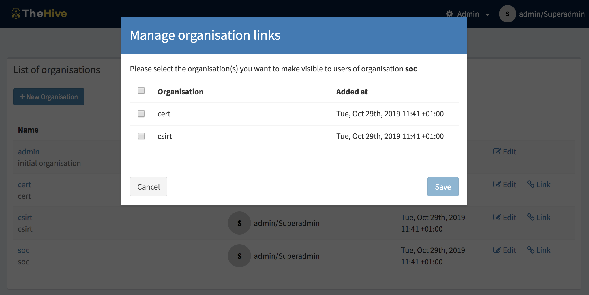
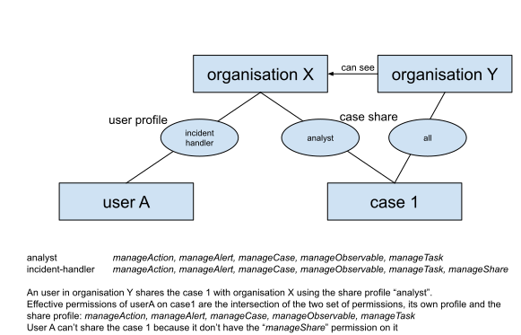
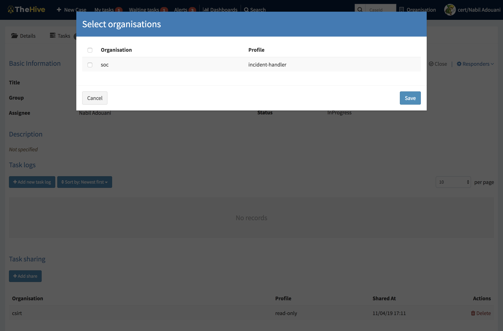

# Organisations, Users and sharing

  * [User role, profile and permission](#user-role--profile-and-permission)
    + [User](#user)
  * [Organisations and sharing](#organisations-and-sharing)
    + [Link with other organisations](#link-with-other-organisations)
    + [Share and effective permissions](#share-and-effective-permissions)

## User role, profile and permission

### User

In TheHive, a user is a member of one or more organisations. One user has a profile **for each** organisation and can have different profiles for different organisations. For example:

- “*analyst*” in “*organisationA*”;
- and “*admin*” in “*organisationB*”;
- and “*read-only*” in “*organisationC*”.

## Organisations and sharing

TheHive comes with a default organisation named "admin" and is dedicated to users with administrator permissions of TheHive instance. This organisation is very specific so that it can manage global objects and cannot contain cases or any other related elements. 

By default, organisations can’t see each other, and can't share with any. To do so, an organisation must be "linked" with another one.  Only super administrators or users with **manageOrganisation** permissions can give the ability of a organisation to see an other one. This ability named “*link*” is unidirectional. 

### Link with other organisations

To share a case with another organisation, a user must be able to see it: its organisation must be "linked" with the targeted organisation. 

###  Share and effective permissions

When a user creates a case, the case is linked to the user’s organisation with the profile “org-admin”. It means that there is no restriction, the effective permissions are the permissions the user has in his organisation.

If he decides to share that case with another organisation, he must choose the profile applied on that share.

To exerce a action on a case, the related permission must be present in the user profile and in the case share.

When you share a case, you can share its tasks or observables but it is not mandatory. Tasks (and observables) can be unitary shared.

They can be shared only with organisations for which case is already shared. A case can be shared only once for a given organisation. Thus a case an its tasks/observables are shared with the same permissions for the same organisation.